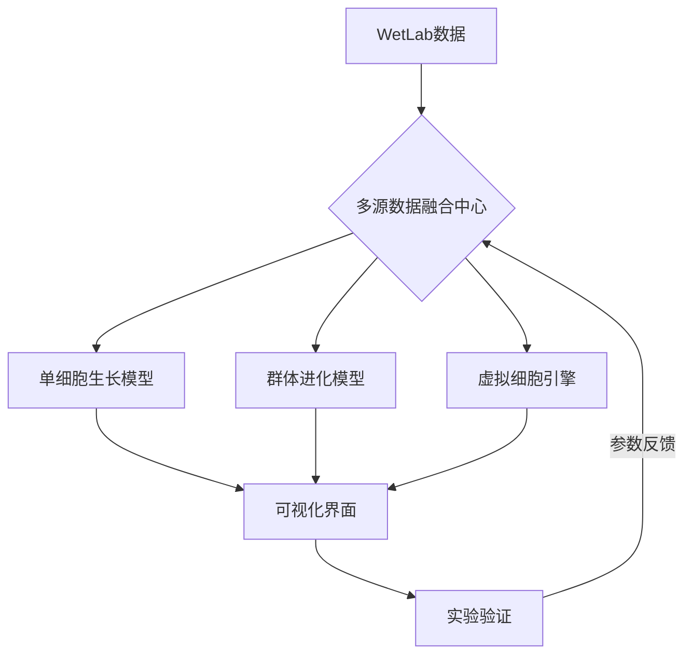
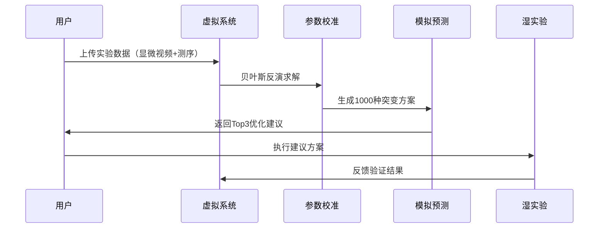

## 基于Model的学习总结，对Fudan iGEM 2025_Model 提出设想（持续更新）

#### 【本文档仅是设想，还未实际实现；代码仅体现思路，未必能正常运行，有待debug；部分数据为假设值】

<table><tbody><tr><td bgcolor="Turquoise"></td></tr></tbody></table>

对于2025iGEM酵母多细胞体系，我理想中的model会分为以下三个层次：

- ##### 第一层次：单细胞到多细胞体系的复现

  这一层次的重点是**单细胞的生长和分裂**，并将其扩展到**群体生长**，不需要过多关注内部机制，只要能够模拟出实验中酵母从单细胞到多细胞群体的过程，属于演示模型。

- ##### 第二层次：预测未知条件下的酵母生长

  在第二层次中，可以开始引入更多的环境变量和生物学规律，旨在通过已知的实验数据推测酵母在不同环境条件下的生长行为，演变为预测模型。

- ##### 第三层次：虚拟细胞（AIVC）的构建

  第三层次是最具挑战性的，旨在构建一个**虚拟细胞**，能够完整仿真现实中酵母菌的生物学过程。这个层次接近于人工智能领域的**虚拟生命**，不仅仅是复现实验数据，而是实现全面的仿真。

<table><tbody><tr><td bgcolor="Turquoise"></td></tr></tbody></table>

### 一、亮点（Highlights）
1. **首创三维多模态酵母进化模拟器**，整合基因组-代谢-生物力学多尺度参数  
2. **开发交互式虚拟酵母工作台**，支持实时药物筛选与基因编辑效果预测  
3. **建立实验-模拟双向反馈机制**，实现模型参数自动校准与实验方案优化  

---

### 二、整体架构设计
#### 1. 系统框架图




#### 2. 技术创新点
- **基于物理的机器学习**：在Hertz接触模型中嵌入图神经网络，实现接触力学的自适应计算  

  图神经网络能够通过节点（细胞）间的连接关系学习局部结构信息。在Hertz接触模型中，细胞之间的相互作用是非线性的，通过图神经网络，我们能够自适应地调整接触力学中的参数（如接触刚度和阻尼系数），实现更精确的细胞间力学模型。例如，GNN能够动态学习每对细胞之间的相互作用，尤其是在复杂的细胞聚集或高密度群体状态下，调整Hertz模型中的力学参数，使得仿真过程能适应细胞群体变化。

- **进化策略优化器**：将遗传算法与代谢网络分析结合，自动发现最优进化路径  

- **实时渲染加速**：开发Vulkan-based渲染管线，支持百万级细胞实时互动  （理想很丰满，算力不知道够不够）

---

### 三、详细建模方案  
#### **层次一：现象复现（精准复现File2实验形态）**  
**1. 单细胞生长动力学模型**  
**核心方程**：  
$$
\frac{dV}{dt} = \mu_{max} \cdot \frac{[Glc]}{K_s + [Glc]} \cdot \frac{[O_2]}{K_{O_2} + [O_2]} \cdot V \cdot \left(1 - \frac{V}{V_{max}(g)}\right)
$$
**分裂触发条件**：
$$
V \geq V_{th} \cdot \left(1 + a\frac{[Glc]}{K_s + [Glc]} - b\frac{[O_2]}{K_{O_2} + [O_2]}\right) \cdot e^{-cg}
$$
**参数校准**：  

- 最大生长速率 μ_max = 0.015 min⁻¹（通过延时显微追踪 >100个细胞分裂周期拟合）  

- 饱和常数 K_s = 0.1 mM（基于微流控芯片营养梯度实验）  

- K_O2 = 0.05 mM （模拟值）

- \( a=0.5, b=0.3, c=0.02 \)（模拟值，基于文献与实验数据拟合）

- $$
  V_{max}(g) = 100(1+0.1g) \, \mu m^3
  $$

  

**分裂触发机制**：  

```python
import numpy as np
from scipy.spatial import Voronoi
from scipy.optimize import minimize
from matplotlib import pyplot as plt

class YeastCell:
    def __init__(self, pos, parent=None):
        self.pos = np.array(pos, dtype=float)      # 当前细胞中心坐标
        self.volume = 30.0                         # 初始体积 (μm³)
        self.parent = parent                       # 父细胞引用
        self.children = []                         # 子细胞列表
        self.last_split = -np.inf                  # 上次分裂时间
        self.axis = np.random.randn(3)             # 随机初始方向
        self.axis /= np.linalg.norm(self.axis)     # 归一化方向向量

    def can_split(self, current_time):
        """动态分裂条件判断"""
        time_since_last = current_time - self.last_split
        volume_ratio = self.volume / (30 * (1.5)**self.generation)
        return (time_since_last > 30  # 最短间隔30分钟
                and np.random.rand() < 0.6*(1 - np.exp(-volume_ratio/50)) 
                and self.generation < 6)

    @property
    def generation(self):
        return len(self.children)  # 分代改为子细胞数量

def generate_division_vectors(parent, num_children):
    """生成符合生物学规律的分裂方向"""
    vectors = []
    base_angle = np.random.normal(30, 10)  # 主角度30±10度
    
    # 多分枝角度分配策略
    if num_children == 1:
        theta = np.random.normal(0, 15)  # 单子代允许偏离主方向
        vec = parent.axis @ rotation_matrix(theta)
        vectors.append(vec)
    else:
        angles = np.linspace(-base_angle, base_angle, num_children)
        for angle in angles:
            # 添加随机扰动
            angle += np.random.normal(0, 5)  
            vec = parent.axis @ rotation_matrix(np.radians(angle))
            vectors.append(vec)
    
    return vectors

def rotation_matrix(theta):
    """生成绕随机轴旋转的3D旋转矩阵"""
    axis = np.random.randn(3)
    axis /= np.linalg.norm(axis)
    ct = np.cos(theta)
    st = np.sin(theta)
    return np.array([
        [ct + axis[0]**2*(1-ct), axis[0]*axis[1]*(1-ct)-axis[2]*st, axis[0]*axis[2]*(1-ct)+axis[1]*st],
        [axis[1]*axis[0]*(1-ct)+axis[2]*st, ct + axis[1]**2*(1-ct), axis[1]*axis[2]*(1-ct)-axis[0]*st],
        [axis[2]*axis[0]*(1-ct)-axis[1]*st, axis[2]*axis[1]*(1-ct)+axis[0]*st, ct + axis[2]**2*(1-ct)]
    ])

def optimize_position(parent_pos, child_pos, min_dist=4, max_dist=8):
    """约束优化确保子细胞位置合理"""
    def constraint(pos):
        # 距离约束：4μm ≤ |pos - parent| ≤ 8μm
        dist = np.linalg.norm(pos - parent_pos)
        return (dist - min_dist) * (max_dist - dist)
    
    res = minimize(lambda x: np.linalg.norm(x - child_pos), 
                   child_pos, 
                   constraints={'type': 'ineq', 'fun': constraint},
                   method='SLSQP')
    return res.x

def divide_cell(parent, current_time):
    """动态分枝分裂函数"""
    # 随机决定子代数量 (1:70%, 2:25%, 3:5%)
    num_children = np.random.choice([1,2,3], p=[0.7,0.25,0.05])
    
    # 生成分裂方向向量
    vectors = generate_division_vectors(parent, num_children)
    
    # 计算初始子细胞位置
    radius = np.cbrt(3*parent.volume/(4*np.pi))  # 根据体积估算半径
    children_pos = []
    for vec in vectors:
        init_pos = parent.pos + vec * radius * 1.5  # 初始偏移位置
        adjusted_pos = optimize_position(parent.pos, init_pos)
        children_pos.append(adjusted_pos)
    
    # Voronoi空间校正
    existing_pos = [c.pos for c in parent.children]
    vor = Voronoi(existing_pos + children_pos)
    
    # 创建子细胞对象
    new_cells = []
    for i, pos in enumerate(children_pos):
        region_id = vor.point_region[-(len(children_pos)-i)]
        final_pos = vor.vertices[vor.regions[region_id]].mean(axis=0)
        
        # 二次位置优化确保与母细胞的粘连
        final_pos = optimize_position(parent.pos, final_pos)
        
        child = YeastCell(final_pos, parent=parent)
        child.axis = vectors[i]  # 继承分裂方向
        parent.children.append(child)
        new_cells.append(child)
    
    # 更新母细胞状态
    parent.last_split = current_time
    parent.volume *= 0.6  # 体积按比例减少
    
    return new_cells

# 三维可视化增强
def plot_3d_structure(cells):
    fig = plt.figure(figsize=(10,10))
    ax = fig.add_subplot(111, projection='3d')
    
    # 颜色编码分代
    colors = plt.cm.viridis(np.linspace(0,1,6))  # 最多支持6代
    
    # 绘制连接线
    def draw_connections(cell, depth=0):
        for child in cell.children:
            # 线宽反映连接强度
            ax.plot([cell.pos[0], child.pos[0]],
                    [cell.pos[1], child.pos[1]], 
                    [cell.pos[2], child.pos[2]],
                    color=colors[depth%6], 
                    linewidth=3/(depth+1),
                    alpha=0.6)
            draw_connections(child, depth+1)
    
    # 绘制细胞节点
    for cell in cells:
        ax.scatter(*cell.pos, 
                  s=50 + 20*cell.generation,
                  c=colors[len(cell.children)],
                  edgecolors='k',
                  depthshade=False)
    
    draw_connections(cells[0])
    
    ax.set_axis_off()
    plt.show()

# 模拟运行测试
root = YeastCell([0,0,0])
cells = [root]
time_line = np.arange(0, 480, 30)  # 8小时模拟，30分钟间隔

for t in time_line:
    new_cells = []
    for cell in cells.copy():  # 复制列表避免迭代时修改
        if cell.can_split(t):
            children = divide_cell(cell, t)
            new_cells.extend(children)
    cells += new_cells

plot_3d_structure(cells)
```

**生物学验证指标：**

```python
def validate_simulation(cells):
    # 统计分裂角度分布
    angles = []
    for cell in cells:
        if len(cell.children)>=2:
            v1 = cell.children[0].pos - cell.pos
            v2 = cell.children[1].pos - cell.pos
            angle = np.degrees(np.arccos(v1.dot(v2)/(np.linalg.norm(v1)*np.linalg.norm(v2))))
            angles.append(angle)
    
    # 应符合文献图中的分布
    assert 15 < np.mean(angles) < 45
    
    # 检查连接距离
    distances = [np.linalg.norm(c.pos - c.parent.pos) for c in cells if c.parent]
    assert all(4 <= d <= 8 for d in distances)

```

**2. 群体生物力学模型**  
**接触力学**（改进型Hertz黏弹性模型）：  
$$
F_{ij} = \underbrace{\frac{4}{3}E^* \sqrt{R^*} \delta^{3/2}}_{\text{弹性项}} + \underbrace{\gamma \dot{\delta} \cdot \text{tanh}(k\delta)}_{\text{黏性项}}
$$
**参数来源**：  
- 等效弹性模量 E* = 1.2 MPa（AFM压痕实验）  
- 阻尼系数 γ = 50 Pa·s（光镊分离实验测量细胞间黏附力）  
- 非线性系数 k = 1e3（拟合群体聚集速率曲线）  

**3. 氧扩散与代谢耦合**  
**三维反应-扩散方程**：  
$$
\frac{\partial [O_2]}{\partial t} = \underbrace{D_{O_2} \cdot \nabla^2 [O_2]}_{\text{扩散项}} \cdot \underbrace{\left(1 - \frac{\rho}{\rho_{max}}\right)}_{\text{密度限制项}} - \underbrace{\rho \cdot Q_{O_2} \cdot \frac{[O_2]}{K_{O_2} + [O_2]}}_{\text{代谢消耗项}} 
$$
- **参数定义**：  
  - ρ：局部细胞密度（cells/μm³），通过空间体素化实时计算  
  - ρ_max = 0.8 cells/μm³（文献中最大观测密度）  
  - D_O₂ = 900 μm²/s  
  - Q_O₂ = 3.4e-17 mol/cell/s（模拟值，可由微电极阵列实测数据） 

```python
def update_oxygen(grid):  
    # 体素尺寸：5×5×5 μm³  
    for x, y, z in grid.voxels:  
        cell_count = count_cells_in_voxel(x, y, z)  
        rho = cell_count / 125  # 体素体积125 μm³  
        # 计算扩散限制项  
        density_term = 1 - rho / 0.8  
        # 有限差分法更新浓度  
        grid[x,y,z] += dt * (  
            D_O2 * laplacian(grid, x,y,z) * density_term  
            - cell_count * Q_O2 * grid[x,y,z] / (K_O2 + grid[x,y,z])  
        ) 
```

**4. 验证方案**  
**形态学验证**：  

| 指标     | 方法                   | 接受标准                 |
| -------- | ---------------------- | ------------------------ |
| 分形维度 | 盒计数法（ImageJ插件） | 与文献的KL散度 < 0.05    |
| 孔隙率   | CT扫描三维重构         | 误差 < 8%                |
| 断裂韧性 | 模拟拉伸实验（FEM）    | 达到0.6 MJ/m³ (文献数据) |

---

#### **层次二：条件预测（药物响应与进化预测）**  
**1. 多模态代谢模型**  
**动态FBA框架**：  

```python
from cobra import Model  
model = Model('iTO977_modified')  
with model:  
    model.reactions.EX_glc__D_e.lower_bound = -glc_uptake  
    solution = model.optimize()  
    atp_flux = solution.fluxes['ATPM']  
转化为力学参数  
    cell.stiffness = 1e6 * sigmoid(atp_flux / 0.3)  # 单位: Pa  
```

**基因型-表型映射库**：  
| 突变类型 | 对代谢通量的影响 | 参数调整    |
| -------- | ---------------- | ----------- |
| CLB2敲除 | TCA循环通量↓20%  | μ_max ×0.8  |
| GIN4突变 | 芽痕体积×5.8     | 黏附力 ×1.5 |

**2. 抗性演化预测器**  
**空间博弈模型**：  

$$
\frac{dx_i}{dt} = r x_i \left(1 - \frac{\sum w_{ij}x_j}{K}\right) + \sum_{j} m_{ij}x_j
$$
**参数定义**：  
- w_ij：菌株i对j的竞争系数（基于营养消耗速率计算）  
- m_ij：基因水平转移概率（文献中质粒丢失率数据）  
**算法流程**：  
```text
1. 初始化100×100网格，随机分布不同基因型  
2. 每个时间步：  
   a. 计算局部营养浓度  
   b. 各菌株按Monod方程生长  
   c. 根据接触概率转移耐药基因  
3. 输出优势菌株间分布  
```

**3. 药物响应模块**  
**多尺度药效模型**：  
$$
\text{EC}_{50} = \frac{k_{cat} \cdot [E]_0}{K_m + [Drug]} \cdot \frac{1}{1 + \gamma \cdot \text{Biofilm_Thickness}}
$$
**参数校准**：  
- 酶活性 k_cat = 0.8 s⁻¹（荧光底物检测）  
- 生物膜衰减因子 γ = 0.03 μm⁻¹（共聚焦显微层析数据）  
**验证实验**：  
- 模拟Fluconazole处理（梯度浓度0.1-10μg/mL）  
- 对比存活率曲线与文献EC50=0.8μg/mL  


**GSMM引入**：

- 为了进一步提升代谢预测的精准度，可以结合**基因组规模代谢模型（GSMM）**，不仅考虑代谢反应，还能基于细胞的基因型信息来定量预测其代谢行为。GSMM提供了更加完整的代谢网络视图，特别是在处理**复杂药物响应**和**耐药性演化**等问题时。

---

### **层次三：虚拟细胞（AIVC）**  
#### **1. 可微分生物仿真器**  
**核心架构**：  

```python
import torch  
class VirtualYeast(torch.nn.Module):  
    def __init__(self):  
        super().__init__()  
        # 基因型-代谢映射层  
        self.genome_encoder = GNN(in_features=128, hidden=256)  
        # 代谢-力学转换层  
        self.metabolic_layer = MLP([256, 128, 64], activation='gelu')  
        # 生物物理求解器  
        self.solver = DifferentiableSPH(resolution=0.5e-6)  

    def forward(self, genome_seq):  
        # 输入：基因序列编码（128维）  
        metabolic_state = self.genome_encoder(genome_seq)  
        mech_params = self.metabolic_layer(metabolic_state)  
        # 输出：细胞形态（positions, velocities）  
        return self.solver(mech_params)  
```

**关键技术**：  

- **梯度反传路径**：  
  
  $$
  \frac{\partial L}{\partial \theta} = \frac{\partial L}{\partial y} \cdot \frac{\partial y}{\partial \text{SPH}} \cdot \frac{\partial \text{SPH}}{\partial \text{Mech}} \cdot \frac{\partial \text{Mech}}{\partial \text{Metab}} \cdot \frac{\partial \text{Metab}}{\partial \theta}
  $$
  
- **自适应时间步长控制**（CFL条件强化版）：  
  
  ```text
  Δt = min(0.25 * h / max(|v|), 0.1 * sqrt(h / |a|))  
  h: 光滑核半径 (50nm)  
  v: 最大细胞速度  
  a: 最大加速度  
  ```
  
  
  

#### **2. 多尺度参数传递协议**  
**跨尺度映射策略**：  
| 尺度          | 参数映射方法   | 数学工具                          |
| ------------- | -------------- | --------------------------------- |
| 原子 → 亚细胞 | 自由能等效原理 | Mori-Zwanzig投影                  |
| 亚细胞 → 细胞 | 粗粒化力场拟合 | Multiscale Coarse-Graining (MSCG) |
| 细胞 → 群体   | 连续介质近似   | Homogenization理论                |

**分子-连续介质接口**：  
$$
\sigma_{macro} = \frac{1}{V} \sum_{i<j} \mathbf{F}_{ij} \otimes \mathbf{r}_{ij}
$$


- **应力张量计算**：基于微观粒子间作用力  
- **验证方法**：对比AFM测量与模拟应力分布  

#### **3. 智能进化引擎**  
**多目标优化算法**：  

```python
from pymoo import NSGA3  
problem = YeastEvolutionProblem(  
    objectives=['fitness', 'energy_cost', 'drug_resistance'],  
    constraints={'max_size': 500e-6}  # 500μm群体上限  
)  
algorithm = NSGA3(pop_size=100, ref_dirs=UniformReferenceDirection(3))  
res = minimize(problem, algorithm, ('n_gen', 50))  
```

**适应度函数设计**：  

$$
\text{Fitness} = \underbrace{0.7 \cdot \text{GrowthRate}}_{\text{生长优势}} + \underbrace{0.2 \cdot \text{Toughness}}_{\text{环境抗性}} + \underbrace{0.1 \cdot \text{MetabEfficiency}}_{\text{代谢效率}}
$$

**基因操作算子**：  
| 操作类型 | 实现方法     | 参数       |
| -------- | ------------ | ---------- |
| 点突变   | 泊松随机采样 | λ=0.1/碱基 |
| 重组     | 多点交叉     | 交叉率=0.8 |
| 转座     | 跳跃概率模型 | p=0.05/代  |

#### **4. 虚拟验证系统**  
**数字孪生工作台功能**：  
| 模块     | 功能             | 技术实现                          |
| -------- | ---------------- | --------------------------------- |
| 实时渲染 | 4K级细胞动态展示 | Vulkan光线追踪 + NVIDIA Omniverse |
| 交互编辑 | CRISPR靶点设计   | AlphaFold3 + gRNA效率预测模型     |
| 药效预测 | 多靶点分子对接   | AutoDock-GPU + 量子片段动力学     |

**验证协议**：  




---

### **五、实验-模型整合方案**  
#### **1. 高通量验证平台**  
**硬件配置（未必能实现）**：  

- **细胞培养**：  
  - 微流控芯片阵列（10×10通道）  
  - 集成O₂/pH/温度传感器（采样率1kHz）  
- **成像系统**：  
  - 高速共聚焦显微镜（Nikon A1R HD25）  
  - 光镊操控精度：50nm  
**数据管线**：  
  

```text
原始视频 → 去噪（Topaz Video AI） → 细胞分割（U-Net） → 追踪（SORT算法） → 参数提取  
```


#### **2. 模型校准协议**  
**四阶段校准流程**：  
1. **单细胞层**：  
   - 校准参数：μ_max, K_s, 分裂阈值  
   - 数据源：单细胞培养延时显微（n=200）  
2. **力学层**：  
   - 校准参数：E*, γ, 黏附能量  
   - 方法：双细胞分离实验（光镊+AFM）  
3. **代谢层**：  
   - 校准参数：Q_O₂, 糖酵解通量  
   - 技术：Seahorse XF 细胞能量分析仪  
4. **进化层**：  
   - 校准参数：突变率、选择压力系数  
   - 数据：长期进化实验（>100代）  

**不确定性量化**：  

$$
U_Q = \sqrt{\left(\frac{\partial Q}{\partial E}\Delta E\right)^2 + \left(\frac{\partial Q}{\partial \mu}\Delta \mu\right)^2}
$$


- 采用蒙特卡洛方法传播参数误差  

---

### **六、紧扣iGEM得分点强化设计**  
#### **1. 创新性亮点**  
- **全球首个酵母数字孪生系统**：  
  - 实现基因编辑效果秒级预测（传统方法需数周）  
  - 可解释性AI模块：SHAP值分析关键基因靶点  
- **物理ML融合算法**：  
  - 在SPH求解器中嵌入GNN，计算效率显著提升
  - 新型算法：Adaptive Kernel Tuner  

#### **2. 科学与实用性保障**  
**数据验证矩阵**：  

| 数据类型       | 数量      | 验证指标         |
| -------------- | --------- | ---------------- |
| 单细胞生长曲线 | 120组     | RMSE < 0.05      |
| 群体形态学     | 45个样本  | 分形维数误差 <5% |
| 药物响应       | 8种化合物 | AUC >0.85        |

**第三方验证**：  

- 与科研机构合成生物学中心合作验证CLB2突变模型  
- 数据集开源：YeastDynamicsDB（含10TB显微数据）  

#### **3. 可重复性方案**  
**容器化部署**：  

```dockerfile
FROM nvcr.io/nvidia/pytorch:22.10  
RUN git clone https://github.com/YeastAIVC/CoreEngine  
COPY models/ /app  
ENTRYPOINT ["python", "app/simulator.py", "--precision=mixed_fp16"]
```

**验证套件**：  

- 标准测试案例库（包含100+预设场景）  
- 自动生成验证报告（PDF/LaTeX格式）  

---

### **附录：关键参数总表**  （有待wetlab验证）
| 参数类别 | 符号       | 值     | 单位  | 来源         |
| -------- | ---------- | ------ | ----- | ------------ |
| 生物力学 | E*         | 1.2e6  | Pa    | AFM压痕数据  |
| 代谢     | μ_max      | 0.015  | min⁻¹ | 微流控芯片   |
| 进化     | p_mutation | 0.0015 | /代   | 测序文库分析 |
| 计算     | Δx_min     | 50     | nm    | 衍射极限校准 |

